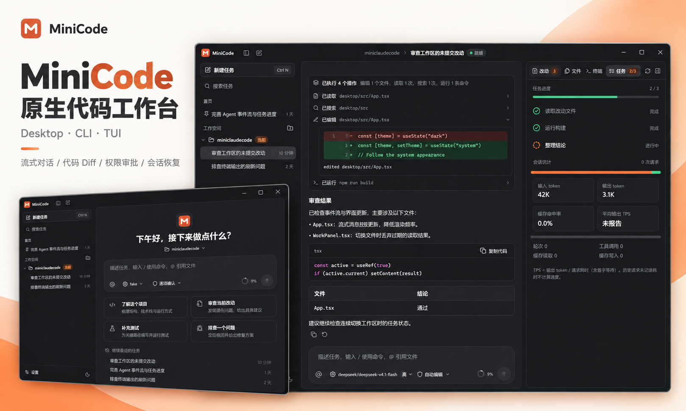

<div align="center">


# MiniCode

**面向本地代码仓库的原生 AI 编程工作台**

Desktop · CLI · TUI — 一个运行核心，三种工作方式

流式对话 · 代码修改与 Diff · 权限审批 · 会话恢复 · Skills / MCP

[](https://github.com/oysterhyd/minicode/releases/latest)

[](https://github.com/oysterhyd/minicode/actions/workflows/tests.yml)
[](LICENSE)

[下载安装](https://github.com/oysterhyd/minicode/releases/latest) · [快速开始](#快速开始) · [功能介绍](#功能介绍) · [文档](#文档)



<sub>以 MyGo 原生界面截图为参考，通过生图制作的产品介绍图。界面内容来自隔离测试数据。</sub>

</div>

## 关于 MiniCode

MiniCode 将自然语言任务、代码工具和执行记录放在同一个工作台中。你可以让它梳理项目、
定位问题、修改文件或运行测试，再通过对话、Diff 和命令输出检查结果。

桌面端使用 MyGo native UI，Windows 由 Direct3D 11 绘制，提供可视化任务管理与代码审查界面；CLI 适合终端中的日常工作和脚本调用；
TUI 提供 Claude Code 风格的终端对话界面。三种入口复用同一个 Agent Runtime、权限机制和持久会话。

MiniCode 支持接入自己的 OpenAI 兼容服务或 Anthropic 服务，并通过 Skills、MCP 和
本地插件扩展项目能力。

## 快速开始

### Windows 安装版

1. 从 [GitHub Releases](https://github.com/oysterhyd/minicode/releases/latest) 下载
   `MiniCode-Setup-<版本>-win-x64.exe`，运行安装向导。
2. 打开 **MiniCode**，在 **设置 → 模型与预算** 中添加 AI 服务，填写服务地址、
   API key 和模型 ID，测试连接并选择默认模型。
3. 打开本地项目，输入任务描述。按提示审查修改或命令，并查看执行结果。

安装版适用于 **Windows 10/11 x64**，内置 Python、Git、Node.js 和桌面端/终端界面依赖，
`minicode chat` / `run` / `tui` 均可直接使用。项目需要的编译器、语言 SDK
和测试依赖仍由项目自身提供。

1.2.0 起 Desktop 使用原生 UI，并内置 GitHub Releases 自动更新。“设置 → 通用”可管理自动检查和自动下载安装，“关于”页可手动检查。1.1.0 用户需要下载安装一次原生版本，后续可在应用内升级。体积、界面响应及 Diff 对比和验收范围见
[原生迁移报告](docs/native-desktop-report.md)。

发行包不包含模型账户或 API key，调用费用由所接入的服务收取。安装包目前未作 Windows 代码签名，更新归档使用 Ed25519 签名，
可使用 Release 中的 `SHA256SUMS.txt` 校验下载文件。

### 终端使用

Windows 安装版在安装目录提供 `minicode.cmd`。在该目录打开 PowerShell 后可以执行：

```powershell
# 查看命令
.\minicode.cmd --help

# 执行一个任务
.\minicode.cmd run "修复失败的测试，并验证修改" --workspace "C:\projects\my-app"

# 开启持续对话或 Claude Code 风格的终端界面
.\minicode.cmd chat --workspace "C:\projects\my-app"
.\minicode.cmd tui --workspace "C:\projects\my-app"
```

CLI 与桌面端共用已添加的 AI 服务和会话。通过 Python 安装后，使用 `minicode` 调用同样的命令。

## 功能介绍

| 能力 | 说明 |
| --- | --- |
| 代码工具 | 读取文件、搜索内容、编辑与写入文件、执行命令；工具调用和输出可回看。 |
| 可视化工作台 | 对话、任务列表、文件树、代码 Diff、Git 暂存和终端记录集中展示。 |
| 流式交互 | Markdown 回复、代码高亮、工具状态、文件引用、斜杠命令和键盘快捷操作。 |
| 权限审批 | 修改与命令遵循所选权限模式；可逐项审批，也可为当前会话记住授权。 |
| 会话恢复 | 持久保存消息、事件、用量和运行状态，支持查看历史与继续任务。 |
| 模型服务 | 支持 OpenAI Chat Completions 与 Anthropic Messages，可管理多个服务和模型。 |
| 上下文与预算 | 上下文压缩、长输出归档，以及轮数、token 和时长预算。 |
| 任务验收 | 可配置验收命令，将测试结果和工作区状态作为完成任务的证据。 |
| 扩展能力 | 项目指令、Skills、本地 stdio MCP、插件和可配置子助手。 |
| 执行记录 | 会话事件、命令退出码、修改摘要、用量统计和 HTML 执行报告。 |

### 从任务到结果

给出目标后，MiniCode 会通过代码工具收集上下文、执行修改并运行检查。
桌面端将连续工具调用整理为操作分组，修改可在右侧 Diff 中审查，命令输出可展开查看。
需要授权时，审批卡片会展示具体内容；任务结束后，可以继续追问或回到历史会话。

适合交给 MiniCode 的任务包括：

- **了解项目**：梳理目录、技术栈、主要模块和运行方式。
- **定位问题**：结合代码、错误信息和测试结果查找原因。
- **实现修改**：修复缺陷、补充测试、完成有明确范围的功能。
- **审查改动**：检查工作区 Diff、运行验证并整理发现。

### 按项目扩展

MiniCode 可以读取项目中的 `AGENTS.md`，按需加载 Skills，并通过本地插件连接
stdio MCP 工具。可配置的子助手适合探索、代码审查和测试等子任务，沿用父会话的
权限与预算。项目记忆可由用户维护，帮助后续会话保留明确的项目事实。

插件通过 manifest 描述能力与版本，并可锁定内容指纹。
完整配置格式见 [架构文档](docs/architecture.md)，示例见
[本地文档 MCP 插件](examples/mcp_docs/plugin.json)。

## 权限与数据

MiniCode 在所选工作区内运行代码工具，并在本机保存会话、配置和执行记录。
使用远程模型时，提示词、相关代码上下文和工具输出会发送到你选择的 AI 服务。

默认权限模式要求审批写入与命令操作；`accept_edits` 和 `bypass` 模式会扩大自动执行范围。
权限审批是执行控制机制，不能替代操作系统沙箱。运行命令、启用插件或连接 MCP 服务前，
应确认工作区和工具来源可信。

会话可以在中断后恢复。对于执行结果未知的写入或命令，运行时会保留状态，
避免把恢复等同于自动重放副作用。

## 平台与支持范围

- **Windows**：提供 Desktop + CLI 安装包。
- **Windows / Linux**：CLI 通过 Python 安装，CI 覆盖 Python 3.11 与 3.12。
- **macOS**：目前没有发行安装包或专门的 CI 验证。
- **MCP**：当前支持本地 stdio 工具；远程 HTTP、OAuth 和插件自动安装尚未提供。
- **后台任务**：支持当前进程内的后台命令；跨进程持久后台服务和多 worker worktree 调度尚未提供。

## 源码安装与开发

CLI 要求 **Python 3.11+**；TUI 开发需要 **Node.js 22+**；原生 Desktop 开发需要 **Go 1.27.1 和 PowerShell 7**。

```bash
git clone https://github.com/oysterhyd/minicode.git
cd minicode
python -m venv .venv
```

激活虚拟环境后安装依赖：

```bash
python -m pip install -e ".[dev]"
minicode --help
```

启动终端 TUI 开发环境：

```bash
npm ci --prefix tui
npm run build --prefix tui
minicode tui --provider fake
```

TUI 使用紧凑对话布局和底部输入区。`Ctrl+J` 换行，`Ctrl+O` 展开工具输出，
`Ctrl+C` 中断当前回合，空输入时两次 `Ctrl+C` 退出；审批使用 `Y` / `A` / `N`。
运行中提交的多条消息按顺序排队，取消或暂停后可按 `Enter` 手动发送下一条。

启动桌面端开发环境：

```bash
pwsh -NoProfile -File desktop/native/dev.ps1
```

运行测试：

```bash
python -m pytest tests
npm test --prefix tui
cd desktop/native
go test -count=1 ./...
```

Windows 安装包的构建入口位于 [`release/`](release/README.md)，桌面端开发说明见
[`desktop/README.md`](desktop/README.md)。

## 文档

| 文档 | 内容 |
| --- | --- |
| [安装与发行](release/README.md) | 安装说明、CLI 入口、构建和校验。 |
| [桌面端](desktop/README.md) | 工作台、模型管理、权限、快捷键与开发。 |
| [原生迁移报告](docs/native-desktop-report.md) | 安装包体积、实测响应、Diff 性能与验收范围。 |
| [架构](docs/architecture.md) | 运行核心、工具、会话存储与扩展契约。 |
| [MCP 示例](examples/mcp_docs/plugin.json) | 本地文档工具插件的 manifest 与示例实现。 |
| [许可证](LICENSE) | MIT 许可证。 |

## 参与贡献

欢迎通过 [Issues](https://github.com/oysterhyd/minicode/issues) 报告问题或提出功能建议，
也欢迎提交 Pull Request。问题报告请包含复现步骤、系统版本和必要的错误信息；
分享日志前请移除 API key、服务凭据和敏感项目内容。

## 许可证

MiniCode 使用 [MIT License](LICENSE)。安装包内第三方软件的许可说明见
[Third-party notices](release/THIRD-PARTY-NOTICES.md)。
