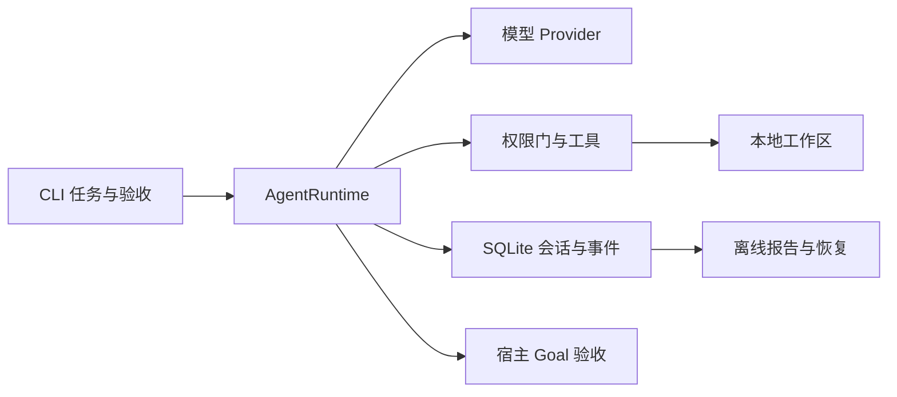

# minicode（Mini Claude Code）

**Windows 安装版 v1.0.0**：CLI 与 Desktop 已集成打包，内置 Python、Git 与依赖。
从 [GitHub Releases](https://github.com/oysterhyd/minicode/releases/latest) 下载安装包；
安装后在设置中填写自己的 AI 服务凭据即可使用。使用和构建说明见
[集成发行项目](release/README.md)。

一个面向本地代码仓库的轻量级 CLI Coding Agent：用户给出任务描述，它通过工具调用检索代码、
修改文件、运行测试，在权限与资源预算内迭代，并留下可审查的 diff、命令退出码和执行记录。
定位是**CLI、TUI 与 desktop 共用的本地 Agent Harness**——模型决定如何解决任务，Runtime 负责
执行协议、权限、预算、取消与持久化；不将调用模型包装成模型训练能力，也不宣称完整复刻商业
Claude Code。

**当前状态（2026-09-30 核对）**：核心已按单会话所有权、原子检查点、工具能力声明、扩展生命周期与并发宿主协议重构；迁移、验收契约与能力边界见 [Harness 重构审计](docs/harness-hardening.md)。P0 最小闭环——单轮任务、交互会话、基础工具、权限审批、
预算与取消、SQLite 会话持久化与执行报告——已实现。P1 已接入分层上下文压缩与输出归档、
会话恢复与未知副作用处理、Goal 验收器与证据绑定、后台命令、20 任务离线评测集、HTML
执行报告和 Textual 全屏 TUI。压缩及归档仍有边界限制，见下方说明。
优化方案 A–D 已接入：项目指令、按需加载的 Skills、单层可配置子助手、stdio MCP 与本地 Plugins。
持久任务图已通过 `task_create` / `task_list` / `task_claim` / `task_complete` 接入模型工具；
项目长期记忆由用户显式维护，Agent 只能用 `memory_list` 读取。



**真实模型评测（2026-09-23）**：20 个微型修复任务，CommandCode
`deepseek/deepseek-v4.1-flash`，B0/B2 各运行 3 次；宿主独立执行可见验收、
允许路径检查和工作区外的隐藏测试。

| 基线 | 最终通过 | 误报完成 | 首轮无响应超时 | Runtime 中位耗时 |
| --- | ---: | ---: | ---: | ---: |
| B0 基础循环 | 47/60 | 0 | 3 | 65.8 秒 |
| B2 压缩 + 运行时 Goal 门 | 51/60 | 0 | 1 | 68.0 秒 |

该批运行使用 4 并发、每任务 120 秒上限；网关排队与单文件小题限制了对两基线差异的解释。
详见 [评测方法与限制](docs/evaluation-20260923.md)、[逐次结果](reports/eval-real-20260923/results.json)
和 [配置](reports/eval-real-20260923/config.json)。
另有 [三个补充场景](evals/scenarios/README.md) 覆盖跨文件修复、长日志和验收失败续跑；
其 FakeProvider 离线结果为 B0 2/3、B1 2/3、B2 3/3，不计入上述真实模型结果。
[发布核验](docs/release-readiness.md)列出已验证能力和仍需保留的边界。

**交互与运行时增强**：启动 ASCII Banner（Oyster Harness + 版本/环境信息）、斜杠命令
自动补全（Tab 补全 / ↑↓ 选择 / Esc 关闭 / Enter 确认）、`/model`（z.ai/glm-5.3-flash 与
DeepSeek V4.1 Flash，模型目录配置约 1M 上下文，另含 Claude Sonnet 4.5）与 `/effort`
（off/low/medium/high/xhigh/max；`off` 省略请求字段、采用网关默认值，并不保证关闭推理）、三态权限
状态机 `/permissions`（default / accept_edits / bypass，运行时切换并实时显示于状态栏）、
`/clear` 仅清屏保留上下文、`/new` 彻底重置开启新会话、状态栏实时显示 CWD / Token 用量 /
本轮与会话累计的输入缓存命中率 / 上下文窗口负载 / 权限模式 / 模型。

## 快速开始

要求 Python 3.11+（Windows / Linux 均可）。

```bash
# 在本仓库根目录执行
python -m venv .venv
.venv/bin/python -m pip install -e ".[dev]"  # Linux/macOS
```

Windows PowerShell 用 `.\.venv\Scripts\python.exe -m pip install -e ".[dev]"`
替换第二行；后续可用 `.\.venv\Scripts\minicode.exe`，无需激活环境。

Windows + Python 3.12 可用 [已验证依赖快照](requirements-windows-py312.lock)
替换最后一步：`python -m pip install -r requirements-windows-py312.lock`。
其他平台和 Python 版本由 CI 的安装与测试矩阵验证；本地快照不冒充跨平台锁文件。

### 模型 provider

`--provider auto`（默认）优先采用共享配置的默认模型；可显式用 `--model <服务ID::模型ID>` 选择 desktop 中配置的自定义服务。未设置默认模型时按以下顺序选择：

1. `commandcode`——OpenAI 兼容网关（默认模型 `deepseek/deepseek-v4.1-flash`）。凭证来源：
   环境变量 `COMMANDCODE_API_KEY`（可选 `COMMANDCODE_BASE_URL`），或自动发现本机
   ZCode 安装的 provider 配置（`~/.zcode/v2/provider_config.json` 中的 "Command Code"）。
2. `anthropic`——设置了 `ANTHROPIC_API_KEY` 时可用。
3. 其他已启用且有凭据的配置服务。没有可用服务时报告配置错误。`fake` 仅在显式 `--provider fake` 或 `--script` 时用于确定性测试与示例回放。

### 无密钥演示（FakeProvider 一键重放修复过程）

`examples/pagination` 是一个带分页边界 bug 的微型仓库；下面的命令用确定性的 FakeProvider
脚本重放「读文件 → 改文件 → 跑测试 → 总结」的完整修复过程，不需要任何 API key。
演示会**实际修改**工作区内的文件，建议先复制一份再运行：

```bash
cp -r examples/pagination /tmp/pagination-demo   # Windows Git Bash 同样可用
minicode run "修复分页 bug" \
  --workspace /tmp/pagination-demo \
  --provider fake \
  --script examples/pagination/scripts/fix_pagination.json \
  --yes
```

PowerShell 用户请改用下面这段（续行符是反引号 `` ` `` 而非 `\`；`/tmp` 会被解析成当前盘符
根目录，建议用 `$env:TEMP`）：

```powershell
.\.venv\Scripts\Activate.ps1     # 激活后 minicode 直接可用（若报执行策略错误，见下方说明）
Copy-Item -Recurse examples\pagination $env:TEMP\pagination-demo
minicode run "修复分页 bug" --workspace $env:TEMP\pagination-demo --provider fake --script examples\pagination\scripts\fix_pagination.json --yes
```

> 若 `Activate.ps1` 报「在此系统上禁止运行脚本」，执行一次
> `Set-ExecutionPolicy -Scope CurrentUser RemoteSigned`；或跳过激活，直接用
> `.\.venv\Scripts\minicode.exe` 调用（此时脚本内的 `python` 用全局解释器）。

运行结束后会打印退出原因、轮数、token 用量与「修改摘要」（diff）；
`minicode report <会话ID>` 可查看执行记录。脚本中的测试命令假设 PATH 上的 `python`
已安装 pytest，详见 [examples/pagination/README.md](examples/pagination/README.md)。
若直接对仓库内 fixture 运行演示，可用 `git checkout -- examples/pagination/paginate.py`
恢复 bug 以便重放。

### 接真实模型

```bash
export ANTHROPIC_API_KEY=sk-ant-...        # Windows: set ANTHROPIC_API_KEY=...
minicode run "修复分页越界错误，并运行测试验证" --workspace examples/pagination --provider anthropic
```

未指定模型时，`--provider auto` 优先共享默认模型，再按 commandcode → anthropic → 其他已配置服务的可用性顺序选择；
显式选择 Anthropic 时使用上例的 `--provider anthropic`。
不使用 `--yes` 时，`edit` / `write` / `bash` 会在每次执行前请求确认（y/N）。

## CLI 命令

| 命令 | 说明 |
| --- | --- |
| `minicode run "任务"` | 执行一个单轮任务：流式输出回复、`▸/✓/✗` 工具行、修改摘要与统计；`--acceptance` 挂验收配置后，模型自述完成不等于通过 |
| `minicode chat` | 交互式多轮会话；暂停的任务用 `/continue` 原地续跑，`exit` / `quit` / Ctrl+D 退出 |
| `minicode tui` | 全屏交互界面（Textual）：流式回复、可展开工具详情、审批弹窗、运行中输入排队及 `/continue` 等斜杠命令 |
| `minicode sessions list` | 会话列表：ID、创建时间、工作区、模型、状态、轮数、token |
| `minicode resume <会话ID>` | 恢复历史会话；用 `/continue` 续跑暂停任务。已落库结果不重复执行；未确认写入标记状态未知并要求核实 |
| `minicode report <会话ID>` | 执行报告（text）；`--format html` 生成单文件离线 HTML（时间线、工具记录、diff、验收证据、用量） |
| `minicode eval` | 运行 `evals/` 的 20 任务评测集（FakeProvider 离线）；b1 增加压缩与归档，b2 增加外层验收失败续跑；输出 JSON + Markdown 汇总 |
| `minicode memory add/list/update/delete` | 显式管理按项目和目录限定的稳定事实；每条事实记录来源与更新时间 |
| `minicode workflow review --check "python -m pytest" --output <工作区外目录>` | 固定的快照→检查→只读模型审查；journal 支持跨进程续跑 |

若通过 wheel 安装基础包并使用 `minicode eval`，需安装评测额外依赖：
`python -m pip install "minicode[eval]"`。从源码按快速开始安装 `[dev]` 时已包含 pytest。

真实模型重复评测使用 `python -m evals.run_real_eval --baselines b0,b2 --repeats 3`；
每次运行保留干净工作区、SQLite trace 和独立判分记录。此命令会调用当前 CommandCode API。
离线和真实评测的 B2 定义不同：离线 B2 是 runner 外层续跑；真实评测 B2 装配运行时 Goal 门。

常用选项（`run` / `chat` / `tui` 共享）：`--workspace`（默认当前目录）、
`--provider auto|commandcode|anthropic|fake`、`--model`（缺省按 provider 选择）、
`--script`（FakeProvider 脚本 JSON）、`--max-rounds`（默认 0 = 不限）、`--max-tokens`（默认 0 =
不限制累计 token）、`--max-seconds`（默认 0 = 不限，单位秒）、`--yes/-y`（自动允许全部工具）、
`--acceptance <yaml>`（Goal 验收：command / artifact / protected 三类检查项）、
`--db`（默认 `~/.minicode/sessions.db`）。

消息与事件随执行写入 SQLite，用量和轮数逐轮更新。Ctrl+C 取消会保存 `paused` 状态及
`cancelled` 原因（退出码 130）。单次 `run` 若仍暂停，退出码为 2；会话与任务进度可通过
`minicode resume <ID>` 后执行 `/continue` 恢复。

## P0 能力清单

- CLI 单轮执行、交互会话、流式文本展示、Ctrl+C 取消（取消前先持久化）。
- 模型适配器：CommandCode（OpenAI 兼容，默认）、Anthropic（流式）、FakeProvider（确定性脚本）。
- 基础工具（对齐 Pi Agent 的 4 核心工具）：`read`、`bash`、`edit`、`write`，外加只读辅助
  `ls`、`grep`、`read_artifact`（按 offset/limit 回读当前会话归档）。
- 工具参数校验（pydantic schema）、工作区路径边界（含符号链接/junction）、修改与命令审批
  （ALLOW/ASK/DENY 权限门）、命令超时与输出截断。
- 会话持久化（SQLite）、逐事件执行追踪、diff 与命令退出码报告。
- 预算控制：默认不设轮数、时长或累计 token 上限；显式设置的轮数和时长是单次执行切片，
  达到后保存进度，由 `/continue` 或 `resume` 续跑。
  `--max-tokens N` 是显式的会话累计 token 支出保护，
  达到后暂停，恢复时默认保留原上限；可在 `resume` 传入更高的正数，或用 `--max-tokens -1`
  明确取消该上限。重复且无新证据的工具循环会暂停供检查。

## P1 能力清单（可靠性）

- **分层上下文压缩**：超大工具输出转存为 artifact（模型看到预览 + 归档引用）→ 按完整交互单元归档早期历史
  （tool_use 与 tool_result 永不拆散）→ 压缩较旧工具结果 → 仍超阈值时生成确定性结构化摘要。
  工具截断前的完整成功/失败输出先进入归档；模型可通过 `read_artifact` 分页取回。压缩会处理
  单次用户请求内的多轮已闭合工具交互；超长文本会归档并给模型分页读取入口。压缩后仍无法容纳时
  暂停以便切换模型或调整固定提示，不发送注定失败的请求。详细边界见
  [架构说明](docs/architecture.md#52-上下文压缩与归档)。
- **工具输出边界**：`read` 每页最多 2,000 行或 50 KiB UTF-8，并给出 `next_offset` / `next_cursor`；
  行号采用紧凑格式，减少重复空白占用的上下文；
  `grep` 默认区分大小写、返回最多 100 条，每行最多 500 字符，总展示最多 50 KiB，支持文件或目录路径；
  `ls` 默认仅列当前目录的最多 500 项，递归需 `recursive=true`；大型递归结果以缩进目录树显示，
  避免在每个文件名之前重复长路径。`bash` 前台命令默认 300 秒超时、上限 3600 秒，
  显式 `timeout_s` 可覆盖；后台任务不受默认超时约束（仅在显式给出 `timeout_s` 时受限），
  两种方式均展示末尾最多 2,000 行或 50 KiB，截断原文归档后可分页读取。
- **会话恢复**：`resume` 恢复消息、逐轮用量、轮数和模型配置；`/continue` 无需重复提交用户任务。
  已落库结果不重放；未确认只读调用重新检查当前权限后执行，写/Shell 副作用标记状态未知。
- **异常恢复**：无文本的临时 Provider 失败最多重试两次；上下文拒绝会尝试归档超长输入并重发；
  模型输出截断会提示短续写，连续截断才暂停。工具异常作为结果交给模型，内置只读工具可重试一次。
  文件读取、列表和搜索按页或结果预算返回；大文件编辑采用有界复制，文件写入采用原子替换。
  命令输出有磁盘后备归档及采集配额，达到配额时终止该命令并将失败交回模型。
- **Goal 验收**：验收 YAML 定义命令 / 产物 / 受保护路径三类检查；模型回答后由宿主执行检查，
  通过才判定完成；失败回填结构化报告继续修复（`max_fix_attempts` 上限）；通过的证据绑定
  工作区内容指纹，代码再变即失效重验；受保护路径基线与验收配置随会话持久化，resume 不重新采样；指纹在所有检查完成后计算。
- **后台命令**：`bash` 支持 `background` 参数返回 job id，完成后作为用户消息投递。
  轮次及时长切片续跑期间保持运行；暂停或取消时终止仍在运行的进程树，记录并展示 lost 结果。
- **评测集**：`evals/` 20 个本地任务（分页边界、差一错误、除零保护等），FakeProvider 离线
  运行；b1 接入分层压缩与归档并记录压缩事件，b2 在 runner 外层验收失败后续跑，并非直接评测运行时
  Goal 门。结果含成功率、轮数、脚本用量与失败分析，不代表真实模型能力或 token 节省。
- **HTML 报告**：单文件、零外链、可离线打开；时间线、工具记录与 diff、验收证据表、用量。
- **TUI**：Textual 全屏时间线；回复流式期间合并刷新，完成后渲染 Markdown；工具结果按需展开，
  已归档输出展开后按页读取，可滚动并用 `n` / `p` 翻页。运行状态与耗时独立显示。
  浏览旧记录时保留滚动位置；运行中可编辑并排队下一条输入。前台命令显示最近日志；`Ctrl+I`
  在宽屏打开任务检查侧栏，在窄屏打开覆盖面板，展示用量、改动、验收和子任务。
- **项目指令与 Skills**：根目录 `AGENTS.md` 启动时加载；子目录 `AGENTS.md` 在首次访问对应范围时加载并要求重试该次工具调用。会话记录来源路径与内容哈希；变更后恢复会提示冲突。扫描项目 `.minicode/skills/<name>/SKILL.md` 和用户 `~/.minicode/skills/<name>/SKILL.md` 的元数据，`/skill` 列出、`/skill <name>` 激活、`/skill off <name>` 停用；模型也可用 `skills_list`、`skill_load`、`skill_unload`、`skill_resource`。技能正文只在激活时加载，资源读取限于注册目录，脚本执行仍走普通 `bash` 审批。
- **可配置子任务**：CLI 与 desktop 共用内置模板和个人子助手。自定义子助手按所选工具或继承的父工具运行，遵守父权限与审批；插件子助手继续只注册 `read`、`ls`、`grep`、`read_artifact`。写入型子助手在父会话内按序执行。同一模型响应中的独立子任务最多两个并行；设置显式累计 token 上限时串行执行。子任务与父会话共享预算与取消；暂停后保留原会话，重复委派同一任务时续跑。父会话记录子会话 ID、用量和结果，返回摘要、发现、经工具记录验证的文件引用与未解决项。
- **MCP 与 Plugins**：项目目录 `.minicode/plugins/<name>/plugin.json` 描述插件版本、启停、Skills、只读子助手和本地 stdio MCP server。工具经官方 Python SDK 发现并注册为 `mcp__<server>__<tool>`；调用沿用权限审批、事件、预算和完整输出归档，服务端只读注解不会自动免审批。`minicode plugins list` 查看来源与指纹，`minicode plugins lock` 生成 `.minicode/plugins.lock.json` 锁定版本和内容。复制 `examples/mcp_docs` 到 `.minicode/plugins/docs` 可试运行本地文档 server；将 `enabled` 设为 `false` 可停用插件，修改后重新生成锁文件。
- **任务图与记忆**：任务依赖、认领与完成持久保存在会话数据库；依赖未完成时不能认领，完成任务时核对 owner。模型可维护任务板，但任务板不自动调度写入型 worker。`minicode memory add "事实" --source "来源" --scope src` 显式保存项目事实；可列出、修订、删除，模型只有只读的 `memory_list` 工具。记忆与会话压缩摘要分别存储。
- **固定 review workflow**：`minicode workflow review` 保存 Git 快照、执行指定检查命令、再启动只读模型审查；每步前后写入 journal。中断时若检查命令状态未知，续跑不会自动重做，核实后需显式使用 `--retry-unknown`；模型审查会从持久会话续跑。

## 本地插件格式

插件目录名需与 manifest 的 `name` 一致。`version` 和 `minicode_version` 使用 `x.y.z`；
`enabled` 控制是否注册能力，省略时默认停用。可选 `skills`、`agents` 指向插件目录内的相对目录；
Skills 使用 `<skills>/<name>/SKILL.md`，只读子助手使用 `<agents>/<name>/AGENT.md`，
两者均需 `name`、`description` YAML front matter。插件能力使用 `plugin:<插件名>:<名称>` 命名空间。
`mcp_servers` 中每项含 `name`、`command`、`args`，可选 `timeout_s`；`$PYTHON` 指当前解释器，
server 的工作目录为插件目录。示例见 [plugin.json](examples/mcp_docs/plugin.json)。
插件锁文件记录每个插件的版本和源文件 SHA-256；内容变动后需审查并运行 `minicode plugins lock`。

## 当前实现边界

- 同一模型响应中连续的内置只读工具最多 4 个并发；写入、命令与未知工具是顺序屏障。
  后台命令在同一进程的执行期间保持运行；暂停、取消或进程退出时无法跨进程继承。
- 任务图已接入单 Agent 工具，但不负责自动执行依赖任务，也没有写入型多代理调度。
- 子任务仅在同一模型响应中按最多两个独立调用并行；显式累计 token 上限下仍串行。证据引用仅验证子任务成功读取过对应路径及路径仍存在，不做语义真实性判断。
- MCP 首版仅支持本地 stdio 工具；断连、超时和发现失败会显示明确状态。Resources、Prompts、远程 HTTP、OAuth 和插件自动安装仍未接入。
- 缓存读/写用量与“provider 未返回 usage”状态会逐请求记入事件、累计写入 SQLite，并在 resume 后恢复；
  Anthropic 请求尚未主动配置 `cache_control`，OpenAI 兼容协议也不保证网关支持相同缓存行为。
- TUI 的“本轮”是最近一次模型请求的命中率，“累计”是整个会话 `缓存读取 token / 输入 token`。
  对持续增长、完全复用旧前缀的对话，仅靠本会话缓存的累计上限约为
  `1 - 最后一轮 prompt token / 各轮 prompt token 之和`；新工具输出首次进入上下文时必然未命中。
  因此应同时检查前缀复用和未命中 token 总量，不把累计 99% 当作固定验收条件。
- token 估算仍采用字符数 / 3，不是服务端 tokenizer 的严格上界；服务端拒绝时会尝试归档缩减后重试。

## 明确未实现（P2）

- 写入型子代理、跨回合持久后台服务。
- 多 worker worktree 协作；固定 review workflow 已提供，通用 workflow 编辑器尚未实现。
- 定时任务、Web 操作界面。

## 架构

一句话：`cli` 负责展示、配置与服务装配，`runtime` 的 AgentRuntime 驱动「流式响应 → 权限门 → 工具执行
→ 结果回填」循环，`core` 提供共享 pydantic 契约，事件与消息实时写入 SQLite。
模块图、事件流与关键语义见 [docs/architecture.md](docs/architecture.md)，
原始设计记录见 [plan.md](plan.md)；本轮功能扩展、TUI 与效率优化建议见
[探索与优化方案](docs/optimization-design.md)（A–C 阶段已实现，D 阶段待迭代）。

## 运行测试

```bash
PYTHONPATH=src python -m pytest tests        # 未安装时
pytest                                       # pip install -e ".[dev]" 之后
```

测试通过 FakeProvider、模拟 provider/client 与临时工作区/数据库验证机制，无需模型密钥，可离线运行。

## 致谢与许可

机制设计基于本地教学项目 [learn-claude-code](learn-claude-code/README-zh.md)
（s01–s17 教学主线）的阅读与改造，未直接复制其代码；项目许可见 [MIT LICENSE](LICENSE)。
