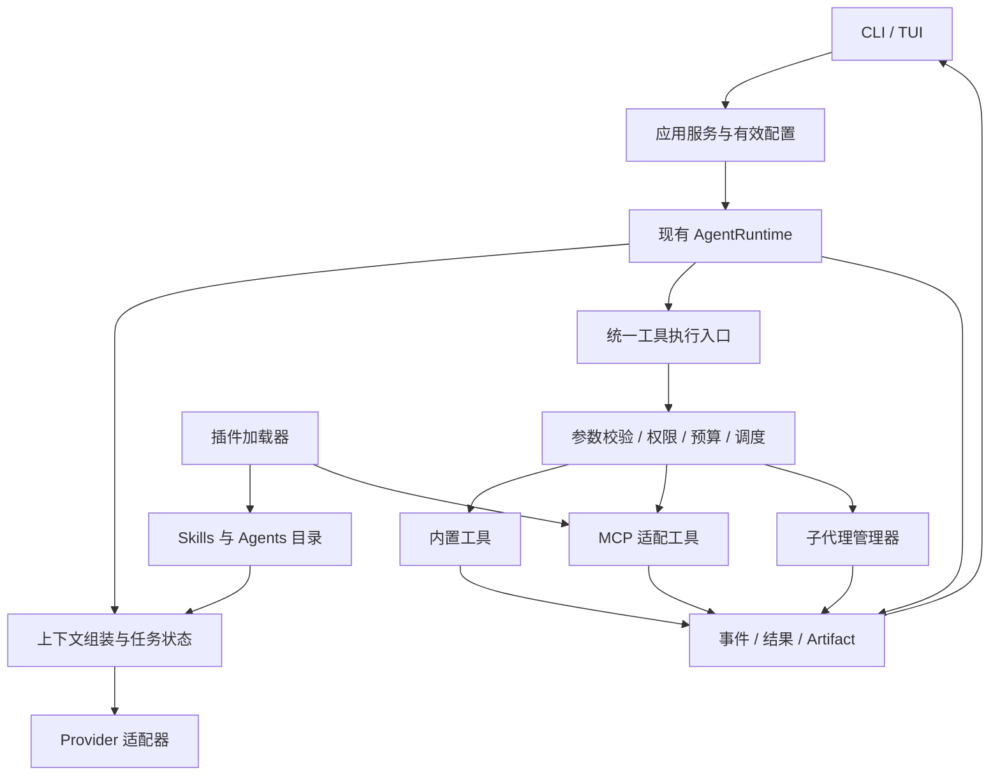

# minicode 探索与优化方案

> 日期：2026-09-22。代码基线：`2572fb0`。
> 状态：设计基线；§7 的 A 阶段已于 2026-09-22 实现，B–D 阶段仍为提案。
> 阅读范围：README、原始 plan、架构说明，以及 CLI、Runtime、Provider、工具、上下文、
> 存储、任务、TUI 和相关测试。没有调用真实模型，也没有测量真实网关的缓存收益。

## 1. 判断与推荐顺序

项目已经有单 Agent 的执行和可靠性骨架：权限、预算、取消、恢复、验收和报告均有实现。
下一阶段值得保留的特色，是让一次编码任务的执行过程可理解、结果可核验、上下文和成本可追踪。

建议沿三条相互配合的路线推进：

1. **先补效率与正确性缺口**：原文可回读、约束可保留、输出预算统一、用量能恢复，再测量提速和省 token。
2. **建立轻量扩展机制**：先项目指令与 Skills，再一层只读 Subagents、MCP，最后用 Plugins 分发这些能力。
3. **TUI 先重组信息，再做动效**：使用清晰的任务状态、可展开工具与结果检查面板，让已有可靠性能力成为可感知的产品体验。

继续使用 Python、asyncio、Textual、SQLite。现有问题不足以支持重写语言、引入庞大编排框架
或立即建设插件市场。多代理也应通过可并行任务上的实测决定是否继续扩展。

## 2. 现状与代码阅读入口

| 阅读顺序 | 入口 | 已实现能力及边界 |
| --- | --- | --- |
| 1 | [cli.py](../src/minicode/cli.py)：`_build_services`、`_new_runtime` | 装配工具、权限、归档、后台命令和可选验收；前端还承担 provider 选择与 REPL 命令 |
| 2 | [core/models.py](../src/minicode/core/models.py) | 消息、工具调用/结果、Usage、预算、事件和退出原因；消息目前是文本及工具块 |
| 3 | [runtime/loop.py](../src/minicode/runtime/loop.py)：`run_turn` | 流式调用模型、串行工具、结果回填、压缩、验收与收尾 |
| 4 | [tools/registry.py](../src/minicode/tools/registry.py) | 注册 read、bash、edit、write、ls、grep 六个工具；没有子代理或归档读取工具 |
| 5 | [context/compact.py](../src/minicode/context/compact.py) | 确定性归档、缩短结果、结构化摘要；配对保护已有，约束保留和超限兜底不足 |
| 6 | [providers/commandcode.py](../src/minicode/providers/commandcode.py)、[Anthropic 适配器](../src/minicode/providers/anthropic_provider.py) | 两种真实 provider；缓存 usage 解析已有，策略和记账尚不完整 |
| 7 | [storage/sqlite_store.py](../src/minicode/storage/sqlite_store.py)、[artifacts.py](../src/minicode/storage/artifacts.py) | 消息、事件、会话及验收基线；压缩会替换消息表，输出归档有宿主读取接口 |
| 8 | [tasks/taskstore.py](../src/minicode/tasks/taskstore.py)、[background.py](../src/minicode/tasks/background.py) | 依赖/事务认领是独立模块；后台命令已接入且随用户回合结束清理 |
| 9 | [ui/app.py](../src/minicode/ui/app.py) | Textual、纯文本流、工具预览、审批、补全、状态栏与全局加载指示器 |
| 10 | [evals/run_eval.py](../evals/run_eval.py) | 20 个 FakeProvider 任务；b1=b0，b2 是 runner 外层验收续跑 |

现有 Subagents、Skills、MCP、Plugins 均为空缺。`TaskStore` 的存在不代表已有任务调度，
`ArtifactStore.read` 的存在也不代表模型可以回读归档。原 README 对这些能力存在过度描述，
本轮已同步修正。

## 3. 需要优先处理的具体问题

本节保留 A 阶段实施前的代码证据，便于对照设计来源；表中五项“高”优先级问题已在 A 阶段解决，
“中”优先级条目仍属于后续阶段。

| 优先级 | 代码证据 | 实际影响 | 建议 |
| --- | --- | --- | --- |
| 高 | `tools/files.py`、`tools/command.py` 先截断；`loop._maybe_spill` 再保存成功输出 | 归档不一定包含完整原文，错误日志也不走相同归档路径 | 原始输出先落盘，再分别生成模型摘要和 UI 预览 |
| 高 | 注册表没有 archive/read_artifact 工具 | 模型看到 artifact ID，却没有对应读取通道 | 加受会话范围限制、可分页的归档读取入口 |
| 高 | `_segment` 按新的 user 文本切分；默认保留四个单元 | 一次用户请求里执行很多轮时，历史调用参数和助手文本可能无法归档 | 按已闭合的模型/工具交互组压缩；用户约束独立保留 |
| 高 | `_archive_summary` 主要摘录助手；`_shrink_old_results` 截取结果前部 | 用户约束和末尾归档引用可能从模型上下文消失 | 显式任务状态、独立引用字段、压缩后约束/引用校验 |
| 高 | `_build_provider` 使用默认 max_tokens；`_provider_for_model` 使用目录最大输出 | 同一模型启动和切换后输出上限不同，压缩预算与实际请求脱节 | 单一有效配置对象供 provider、压缩、预算及 UI 使用 |
| 高 | `Usage` 缺少 cache-write；SQLite、轮次事件及 resume 未完整保存缓存量 | 当前状态栏无法支持跨恢复、跨模型的可靠成本分析 | 按请求持久化完整 usage，区分未知和零 |
| 中 | `run_turn` 对 tool_calls 顺序 await | 独立搜索、读取、外部请求不能并发 | 有限的只读并发组，写入及未知副作用作为屏障 |
| 中 | CommandCode 每次请求创建 `AsyncClient` | 连接复用机会被丢弃 | provider 生命周期内复用 client，显式关闭 |
| 中 | Shell 与 rg 使用 `communicate` 后截断 | 等待期间无日志；输出上限不能限制采集内存 | 流式采集到 artifact，有限内存预览，受控输出预算 |
| 中 | TUI 每个 delta 替换整个文本缓冲区；挂载消息强制滚到底 | 长回答重绘工作增长，浏览旧记录容易被拉回 | 合并刷新、增量展示、仅在用户跟随底部时自动滚动 |
| 中 | `evals.run_combo` 丢弃 compactor 参数，Fake usage 为固定值 | 无法回答压缩、缓存、并发是否真的有效 | 将机制回放和真实模型评测分开，先建立可信基线 |

这里的性能影响属于代码推导，尚无耗时 profile；不能据此承诺某个百分比的提速。

### 3.1 已复现的压缩边界

在内存中构造合法消息序列，使用当前 `ContextCompactor`，没有修改仓库：

| 场景 | 配置与输入 | 观察 |
| --- | --- | --- |
| 单次长任务 | 1 条用户请求，10 轮配对的 write/结果，每轮 content 3000 字符；预算 4000 | `needs_compaction=True`，估算 12124 → 12124，`changed=False` |
| 早期用户约束 | 8 个用户/助手单元，首条要求“绝对不要修改测试文件”；预算 1000 | 归档 4 个单元；约束不再出现在压缩后的模型可见消息中 |
| 旧结果归档引用 | 4 组 read/结果，1000 字符预览末尾带 artifact ID；预算 1000 | 前两条结果缩短，较早结果的 artifact ID 消失 |

估算包含当前计数器默认的 2000 token 输出预留。这些用例验证的是数据变换边界，
不是实际模型最终一定违规，也不是长任务成功率实测。

## 4. 功能架构设计

### 4.1 四类能力的职责

| 能力 | 负责什么 | 建议的第一版 |
| --- | --- | --- |
| Skills | 可复用的操作方法与按需上下文 | SKILL.md 目录发现、摘要目录、显式调用、正文按需读取 |
| Subagents | 独立上下文中的有边界任务 | explore、review 两类只读助手；一层委派；结构化结果 |
| MCP | 外部工具连接协议 | 官方 Python SDK、一个本地 stdio server、发现与调用 |
| Plugins | 这些能力的打包、版本与启停 | 本地 manifest，包含 skills、agents、MCP 配置；命名空间与版本锁 |

Skills 的格式与渐进加载可参考 [Agent Skills 规范](https://agentskills.io/specification)。
Subagents 的独立上下文与摘要返回可参考 [Claude Code 官方说明](https://code.claude.com/docs/en/sub-agents)。
Plugins 作为 skills、agents、hooks、MCP 的组合包，可参考 [官方插件设计](https://code.claude.com/docs/en/plugins)。
这是机制参考；本项目建议先支持清晰的子集，不声称完全兼容其配置和行为。

### 4.2 共享扩展边界

不让每种扩展各自实现权限、取消、预算和日志。沿现有 Runtime 提取以下职责即可：



- **应用服务**：把服务构建、配置切换、恢复等从 CLI 私有函数中提取，CLI 与 TUI 共用。
- **工具执行入口**：增加宿主维护的来源、只读/副作用类别、并发策略、重放策略和输出预算。
  现有权限和恢复代码都按工具名硬编码，扩展时必须一起替换，不能只向 registry 注册新名字。
- **上下文组装**：分开稳定指令、技能目录、任务状态、近期交互和按需引用；不要继续向一个字符串无限追加。
- **事件与用量**：请求/调用/父子任务 ID、耗时、来源、终态和用量可关联；主会话保持单一消息写入者。

这些是随着功能落地逐步提取的模块边界，无需先建设一个完整的通用插件框架。

### 4.3 项目指令与 Skills：先做这一项

第一步补项目指令加载。当前 `build_system_prompt` 没有自动读取 AGENTS.md。建议支持项目根目录
的显式指令文件，记录路径和内容版本；子目录指令在访问相应范围时再加载。显示当前生效来源，
避免一次遍历把整个仓库的说明都放进系统提示。项目长期记忆单独存放，只先支持用户明确保存、
查看和删除，不把摘要自动升级为永久规则。

Skills 采用项目目录 `.minicode/skills/<name>/SKILL.md` 与用户目录 `~/.minicode/skills/`，
两者与未来 plugin 来源统一编成目录。本文目录名为提议，不是现有配置。

1. 扫描元数据：name、description、来源、版本指纹；目录本身设 token 预算。
2. `/skill <name>` 显式激活；模型也可通过轻量发现/加载工具选择技能。
3. 只在激活时读正文；references、assets、scripts 按需访问。
4. 同版本正文不在每轮重复插入；压缩后保留激活记录和必要约束，需要时重读。
5. 外部技能资源使用已注册根目录的受控读取能力，不放宽普通 read 的工作区限制。
6. scripts 的执行走现有命令授权；技能声明不能自行扩大宿主授予的权限。

先以“仓库探索”“代码审查”两个技能验证加载与卸载语义。技能数量变多后再加检索与相关性排序。

### 4.4 Subagents：以减少主上下文噪声为首要目的

采用独立子会话复用 AgentRuntime；不复制整个父会话。输入为子任务目标、用户约束、相关文件/证据引用、
可用工具和预算。输出为 `summary / findings / evidence_refs / unresolved`，主会话只接收这些结果。

建议首版限制：

- explore 与 review；默认最多两个并发子代理、一层委派，先禁用继续派生。
- 只开放 read/grep/ls/受控归档读取。仅隐藏 edit/write 却保留任意 bash，不能称为只读。
- 父子共享总预算并分别记账；并发请求发出前预留可用额度，完成后结算，防止同时透支。
- 父任务取消传播到子任务；状态和证据持久化；崩溃后未结算任务标记 unknown/lost，不静默重复外部副作用。
- 模型路由可配置，但先沿用父模型建立质量基线，再测较便宜模型是否适合检索/审查。

适合并行的是互不依赖的模块调查、差异审查；小改动、紧密依赖的调试步骤直接在主会话完成。
总成本必须计入所有子代理和汇总调用。主上下文变小不代表总 token 自动下降。

后台命令另补 `jobs.list/status/wait/cancel` 或等价接口，等待采用事件唤醒而非模型反复轮询。
在 UI 上区分“助手本轮结束”和“必需任务完成”；配置验收时，仍在运行的必需测试应阻止宣称成功。
跨用户回合的常驻服务生命周期可后做，不直接沿用当前结束即清理的行为来承载它。

### 4.5 MCP：协议适配接入同一个执行入口

先接一个本地只读文档 server，覆盖初始化、工具发现分页、调用、超时、断连与正常关闭；
工具映射为 `mcp__server__tool`，保留服务来源。使用官方 SDK 支持的协商版本，并锁定依赖；
不自己手写 JSON-RPC。工具发现与调用属于 [MCP Tools 协议](https://modelcontextprotocol.io/specification/2025-06-18/server/tools)
的基本机制；该固定版本仅作为阅读参考，不是本文为未来实现指定的协议版本。

服务端注解仅作提示，宿主决定权限、并发和恢复行为。尤其不能把远程 `readOnlyHint` 直接变成
免审批或自动重放资格。MCP 完成后的 UI、归档、预算与错误结果，走和内置工具相同的路径。

工具少时直接注册。工具多时采用目录检索后加载，避免每轮发送所有 schema：

- provider 原生支持延迟工具加载时，使用该能力。
- 不支持时，为当前任务维护稳定的工具子集，只在必要时变更；记录变更对缓存的影响。
- 通用 `discover + call(name,args)` 可保住稳定 schema，但弱化原生参数约束并增加发现轮次，
  应作为经评测选择的后续路径，不默认套用。

Resources/Prompts、远程 HTTP、OAuth 和复杂 server 管理在最小接入通过后再扩展。

### 4.6 Plugins：等前面的原语稳定后再打包

本地 plugin manifest 首先只描述名称、版本、兼容版本、skills 路径、agents 路径和 MCP 配置。
加载器负责校验、命名冲突、启停、内容指纹及锁定版本；插件内容仍由对应的 Skill/Agent/MCP
模块处理。生命周期与能力检查完成后，才考虑安装更新和分发。

Hooks 可作为后续扩展，先只提供只读事件观察；会修改工具参数的 hook 必须发生在最终校验和
授权之前，执行后的 hook 失败不能触发已完成副作用的重试。首版不开放任意自动安装脚本。

## 5. TUI 设计：Oyster Console

### 5.1 现有界面的主要问题

当前约 1400 行 `ui/app.py` 把布局、状态、组件、slash 交互和服务调用放在一起。可见层级主要是
同一滚动区中的若干 Static 与工具卡片。首屏 Banner 占据较多行，顶部和底部重复展示环境信息。
工具输出没有展开入口，模型回复没有 Markdown/代码结构，状态栏信息很长，运行时输入被禁用。

因此应先明确“现在在做什么、做过什么、结果在哪里”，再添加动画。已有全局 LoadingIndicator，
准确的问题是状态反馈不够具体，而不是完全没有动画。

### 5.2 推荐视觉方向

保留 Oyster 的名称，采用“安静的终端工作台”：暗色背景、珍珠色主文本、青绿色焦点、琥珀色
活动指示；成功/错误另有符号与文字。品牌来自统一的字阶、留白、对齐和活动轨迹，避免常驻大型 ASCII 标题。

以下为待验证的起始设计值：

| Token | 初始建议 | 用途 |
| --- | --- | --- |
| background | `#151A1E` | 主背景 |
| surface | `#1D252B` | 输入区与展开详情 |
| text | `#E6E2D8` | 正文 |
| muted | `#A0ADB5` | 路径、耗时、辅助信息 |
| focus | `#74C5B5` | 选中与键盘焦点 |
| active | `#E8BD78` | 正在执行与待审批 |

兼容 truecolor、ANSI 16 色和无颜色模式；动效字符提供 ASCII 回退。保留用户终端字体，不依赖
Nerd Font、Emoji 或网页字体。中文双宽字符、长路径、窄窗口都应进入布局验证。

`ui-ux-pro-max` 的终端查询返回偏网页的设计建议，未采用其页面结构、字体和 CSS 效果。
本文终端视觉方向为本项目提案；采用该技能适用于终端的原则：键盘可达、反馈明确、动效可关闭、
不只靠颜色表达状态。

### 5.3 布局草图

下图为提案，数据仅为示意，不是已实现界面或实测统计：

```text
oyster / minicode     miniclaudecode · main              model · default
──────────────────────────────────────────────────────────────────────
❯ 修复分页问题，保留测试

  我会先核对分页边界和调用位置。

  ✓ 检索 3 个文件                              0.2s   [展开]
  ✓ 读取 paginate.py:1–80                      0.1s
  ◌ 运行 pytest                               4.8s   [日志]
    最近输出：collected 12 items

  改动 1 个文件    +8 −3        验收：运行中      [查看 diff]

──────────────────────────────────────────────────────────────────────
◌ 验证修复 · 已运行 8.2s           子任务 0       Esc 中断
❯ 继续输入补充要求…                              [排队发送]
──────────────────────────────────────────────────────────────────────
上下文 ≈18k / 目标 64k    本轮用量…    缓存…      / 命令 · ? 帮助
```

- 主视图保留“请求—回复—工具—验收”的时间线；连续只读工具可以聚合成一行，按需展开。
- 120 列及以上可打开右侧检查面板，显示任务、diff、日志、上下文分解；80 列使用覆盖面板，
  不永久牺牲主阅读宽度。具体断点用 Pilot 快照确认。
- 底部只保留一个活动行与输入区；状态栏按宽度逐级隐藏次要项，完整数据放入 `/stats`、`/context`。
- 用户滚离底部后显示“有新内容”，不强制拉回。长会话先折叠旧工具结果，再按 profile 决定是否虚拟化。
- 运行时允许编辑下一条输入，提交后明确显示排队；取消、队列和下一轮用户约束由 Runtime 安全点处理，
  不能直接并发修改消息列表。第一版可以先支持排队，后做运行中 steering。

### 5.4 状态与动效

| 状态 | 展示 | 动效/交互 |
| --- | --- | --- |
| 等待模型 | “等待模型响应 · 3.1s” | 小范围 spinner，依据真实请求开始/结束切换 |
| 接收回复 | Markdown 文本、代码块 | 合并流式刷新，末尾轻量光标 |
| 执行工具 | 工具名、对象、耗时 | 只让当前执行行活动；完成后原位变为 ✓/✗ |
| 长命令 | 最新若干日志行、完整日志入口 | 有输出时增量更新；无输出时显示运行时间 |
| 等待审批 | 完整命令、cwd、目标文件或 diff | 暂停普通“正在处理”提示，把焦点交给允许/拒绝 |
| 压缩 | 原估算、压缩后估算、归档引用 | 短暂提示后收为事件行；不伪造百分比进度 |
| 子代理 | 每个子任务的目标和真实状态 | 可展开查看，支持取消；完成结果回到主时间线 |
| 完成 | 改动、验收、费用或未知标记 | 停止活动动画，给出可检查的结果入口 |

建议 spinner 约 8–12 fps，文本刷新合并为约 30–60ms 一批，状态转换约 120–180ms；
这些是起始参数，需实测，不是效果承诺。提供 reduced-motion/无动效选项，不做无限闪烁或全屏渐变。
等待状态反映请求生命周期，不伪装成模型内部思考进度或展示未收到的推理内容。

Textual 已有 [动画 API](https://textual.textualize.io/guide/animation/) 和
[Worker 机制](https://textual.textualize.io/guide/workers/)，可继续使用。
当前同步目录遍历、文件操作、指纹计算若阻塞 event loop，动画也会卡顿；需要 profile 后将重工作
移到受管理的执行器，并保留取消/写入顺序。仅把写操作丢到 `to_thread` 而不处理取消，可能在 UI
已显示取消后继续写文件。

实现时把 `ui/app.py` 逐步拆成组件、主题、显示状态与控制器；由 Runtime 事件更新显示状态，
不要由 spinner 和 UI 定时器推断业务完成。回复结束后完成一次 Markdown 排版，流式阶段避免
每个字符重排整篇长文；任意模型文本和工具文本继续按普通内容处理，不解释为 Rich 控制标记。

## 6. 工具与 token 效率

### 6.1 分开三类成本

- **时延**：模型等待、生成、工具执行、排队、UI 重绘分别计时。
- **上下文大小**：下一次请求实际包含多少输入，是否仍保留做决定所需的信息。
- **账单成本**：非缓存输入、缓存读取、缓存写入、输出及子代理/摘要调用的总费用。

只读工具并发主要改善工具等待时间，不自动减少相同请求的 token；缓存命中主要降低可计费
输入成本和部分延迟，不增加上下文容量。减少 token 也不能以遗漏关键证据、降低成功率为代价。

### 6.2 工具执行改进

1. **只读并发**：同一模型响应里连续的 read/grep/ls 可按宿主策略分组，建议初始并发上限 4。
   遇到 write/edit/bash 或未知副作用就建立屏障；不跨过写入重排读取。
   结果可按完成时间发事件，回填按原调用顺序，保留每个 ID 的成功/失败。当前 read/ls 为同步
   实现，单纯 `gather` 不会让这些 I/O 自动并行，需要一起调整执行层。
2. **输出按用途裁剪**：搜索支持文件列表/计数/匹配上下文；先定位，再读取范围；命令成功给简短摘要，
   失败保留错误段与末尾日志。完整数据始终有引用。read 应能按范围读取大文件，而不是先因整文件大小拒绝。
3. **限制采集成本**：rg 的 `--max-count` 是每文件限制，当前 `communicate` 仍收集所有匹配再取前 N；
   ls 也遍历后才裁剪。改为受控流式收集或明确有界查询，返回截断/剩余结果标记。
4. **连接与 schema 复用**：CommandCode 在同一事件循环内复用连接；当前 CLI chat 每个用户回合
   使用独立 `asyncio.run`，因此要么改成长生命周期 loop，要么只在回合内复用并在结束时关闭，
   不能直接跨 loop 复用同一异步 client。工具 schema 按目录版本缓存，避免每次生成同样内容。
   schema 本地缓存主要节省 CPU，只有发送内容稳定才有助于服务端 prompt cache。
5. **结果复用**：对路径、范围和内容指纹相同的只读请求复用本地结果；编辑及外部文件变化使其失效。
   只有旧内容仍在当前模型上下文中时，才能只返回“未变化”；若已被压缩移除，必须回填内容或可读取引用。
6. **Provider 重试**：区分可重试网络/限流、鉴权和参数错误。只在尚未提交工具副作用的安全边界重试，
   限次数与总时间；工具失败仍交回模型处理，避免盲目重复写操作。

### 6.3 上下文：原始记录与模型工作集分离

建议逐步形成三份数据：

- **原始执行记录**：追加保存消息、完整结果引用和事件，用于审查/恢复；大输出流式落盘。
- **任务状态**：目标、明确用户约束、决定、已改文件、未解决事项、验收与来源引用。
- **模型工作集**：稳定指令、技能目录、版本化任务状态、近期完整交互组及本轮所需内容。

当前 `replace_messages` 重写的是唯一的模型消息视图，结果缩短又未必单独保留原文；后续可用
`context_snapshot + source_message_ids` 保存工作集，并保留追加历史。无需第一步把数据库做成
复杂事件溯源系统，但必须能从快照追到原始证据。

压缩顺序建议：先在工具产出时减噪并保留完整引用 → 归档已闭合且较旧的交互组 → 更新任务状态
→ 在必要时做模型摘要 → 重估与检查硬上限。当前尚未完成的 tool_use/result 组必须一起保护。
模型摘要作为可替换策略，计入自己的 token 与成本；用户明确约束和验收条件由独立字段保留，
不能只依赖摘要模型“记住”。每次摘要都能追溯来源，不能靠摘要授予新的操作权限。

对压缩加三道检查：调用结果配对完整、用户约束与证据引用存在、下一次请求在有效预算内。
若仍超限，先缩小可选材料或采用有限补救；最终返回明确的上下文超限原因，不反复发送同一无效请求。

预算拆为三个值：服务端硬窗口、当前请求输出上限、产品期望的工作集大小。可从 32k/64k/128k
工作集做对照，但不把这些数字写死为产品结论。目录支持 1M 不意味着日常检索都该保留到数十万
token 才压缩。计数优先采用受支持 tokenizer/计数接口，缺失时以按内容类型校准的估算及裕量替代
“字符 / 3 一定保守”的假设，并记录与服务端 usage 的偏差。

### 6.4 Prompt cache：稳定前缀与有限变更

当前有缓存读取统计，但不能因此认定已经实现缓存优化。Anthropic 请求没有主动设置
`cache_control`，CommandCode 的具体后端缓存支持也未经本轮验证。

建议固定工具定义顺序、系统指令与项目指令版本，把每次请求都会变化的状态放到后面的消息。
技能正文在首次激活时追加，避免每轮改写 system。工具目录或项目规则修改时形成明确的新版本，
不要为了缓存保留过时规则。

Anthropic 支持在稳定内容上设置缓存断点；工具、system、messages 的前缀层级，以及修改工具定义
会影响后续缓存，见 [Prompt caching](https://platform.claude.com/docs/en/build-with-claude/prompt-caching)
与 [Tool use with prompt caching](https://platform.claude.com/docs/en/agents-and-tools/tool-use/tool-use-with-prompt-caching)。
是否支持、最小长度、TTL 和费用都交给具体 provider 配置与验证，不从“OpenAI-compatible”推断。

压缩与缓存存在取舍：缩短历史会减少未来输入，却可能改变已有缓存前缀。采用明确触发阈值和更低
的压缩目标，减少连续小改写；稳定前缀保持不动，压缩后的摘要作为一个新的上下文版本。需要同时
测量压缩成本、冷启动代价、后续命中及任务成功率，而不是每轮删除一点旧消息。

成本按 provider/model 的计费口径计算：

```text
总费用 = 非缓存输入 × 单价 + 缓存读取 × 单价
       + 缓存写入 × 单价 + 输出 × 单价
       + 未包含在以上记录中的独立服务费用
```

主代理、子代理、摘要与验收模型的请求使用同一账本，避免重复加总。价格配置带生效日期；
没有 usage 或价格时显示“未知”，不显示为 0。恢复后还原累计缓存量，按模型分组看本轮与会话用量。
命中率是诊断指标，核心指标应是成功完成任务所需的总费用与时间。

## 7. 分阶段落地及验收

下列阶段为本次建议，与原 plan 中的 P0/P1/P2 命名分开。每阶段均形成可演示闭环，不承诺未经试做的工期。

| 阶段 | 主要内容 | 可检查的完成条件 |
| --- | --- | --- |
| A：可靠上下文与测量 | 完整输出先归档、可分页回读、约束/引用保留、有效输出预算统一、usage 持久化 | 长日志可取回；单次长任务可压缩；压缩后配对与约束不丢；resume 统计连续 |
| B：日常体验与低风险提速 | TUI 时间线/详情/状态、文本刷新合并、跟随滚动、连接复用、有界只读并发 | 80/120/160 列可用；长输出不卡输入；取消无残留；写后读顺序不被破坏 |
| C：可复用与委派 | 项目指令、Skills、只读 explore/review、父子预算和取消 | 未启用技能不加载正文；子代理权限不扩大；主会话只收到摘要及可验证证据 |
| D：外部连接与打包 | stdio MCP、工具发现/调用、最小本地 Plugin manifest | 断连可解释；工具同名可区分；扩展走统一权限/归档；版本和来源可追踪 |

实施进度：A 已完成。实现包括截断前原文归档、失败输出归档、会话内分页 `read_artifact`、单次长任务
交互组压缩、用户要求与 artifact 引用保留、压缩后硬窗口门、provider 实际输出上限统一，以及
cache read/write/unknown usage 的逐请求事件与 SQLite schema v4 恢复。B–D 未在本轮提前实现。

之后再选择 worktree 写代理、远程 MCP、项目记忆自动整理、workflow 其中一个深化。
不同时启动所有方向。TUI 的任务面板随 C 阶段接入真实子任务，不提前显示虚构状态。

## 8. 验证与评测设计

本轮相关测试：`test_context_compact.py`、`test_runtime_p1.py`、`test_runtime_regressions.py`、
`test_commandcode_provider.py`、`test_anthropic_provider.py`、`test_tui.py`。
结果 **126 passed，1 skipped**；跳过原因为该环境不可创建符号链接。
首次运行在 pytest 收尾清理公共临时目录时触发 PermissionError；改用新的独立 `--basetemp`
后完整通过。测试使用禁用 bytecode 和 pytest cache 的设置，没有修改测试源码。
这不是全量测试、真实模型评测或人工终端视觉验收。

后续验证分两层：

- **确定性机制测试**：保留 FakeProvider；覆盖压缩配对、约束/引用、归档分页、并发屏障、取消传播、
  预算争用、MCP 断连、插件冲突、缓存 usage 恢复，以及 Textual Pilot 多尺寸布局。
- **真实任务评测**：同模型、同初始仓库、同目标/预算/验收；包含单文件修复、跨文件调查、长日志、
  单次长工具循环、会话恢复及可并行模块审查。每种配置多次运行，报告波动和失败，不挑最佳结果。

逐项消融，先比较 A 与现状，再独立开关并发、缓存策略、Skills 与子代理，避免一次修改太多而无法归因。
缓存实验区分冷启动与预热、保持模型及 TTL 条件可比，并报告供应商限制。

| 指标 | 为什么需要 |
| --- | --- |
| 成功率与误报完成率 | 防止靠少读上下文、少验收换取低费用 |
| 总费用 / 成功次数；全部任务平均费用 | 把失败、重试、子代理和摘要消耗一起计入 |
| 输入/输出/缓存读写 token，按请求与模型拆分 | 解释节省来自哪里；缺失用量保留为未知 |
| 端到端耗时、首个可见响应、工具耗时及排队 | 区分模型慢、工具慢与界面没有反馈 |
| 重复读取、无结果检索、截断后重试、归档回读次数 | 找到工具设计导致的无效往返 |
| 压缩前后大小、约束保留、引用可解析、重读成本 | 检验压缩效果和信息损失 |
| 主代理与子代理分别的成本/延迟/质量 | 避免把主会话节省误认为系统总成本下降 |

方案是否成功应由这些结果决定，当前不预填“节省 50% token”或“并行提速 3 倍”等数字。
