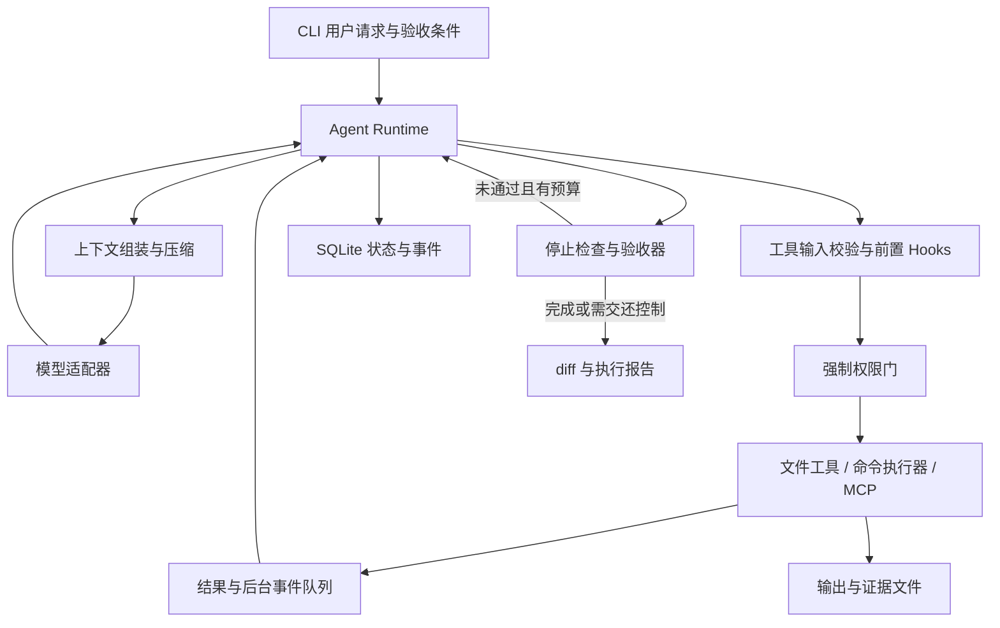

# Mini Claude Code 项目方案

> 日期：2026-09-07。状态：设计方案，尚未实现或完成评测。
> 基于本地 `learn-claude-code/` 新版 s01–s17 教学主线，以及关键实现和测试目录制定。以下工期、指标均为计划，不代表已有成果。

## 1. 项目定位与范围

做一个面向本地代码仓库的 CLI Coding Agent：用户给出任务和验收条件，它能够检索代码、制定步骤、修改文件、执行测试，在权限与资源预算内迭代，并输出可审查的 diff、验证结果和执行记录。

面试定位：**一个具备可恢复执行、上下文预算管理和证据驱动验收的轻量 Agent Harness。** 主要展示 Agent 应用工程、后端运行时和可靠性工程能力；不将调用模型包装成模型训练能力，也不宣称完整复刻商业 Claude Code。

默认假设：个人开发，熟悉 Python，投入约 6–8 周、每周 15–20 小时；优先面向 Agent 应用开发或 AI 工程岗位。先完成单 Agent 的完整闭环，再增加有限的协作与扩展能力。如果只有四周，交付下文 M0–M3，推迟多 Agent 和真实 MCP。

核心演示任务：在一个带测试的小型 Python 仓库中，定位分页边界错误，修复实现，运行验收测试；遇到长日志时压缩上下文；中途退出后恢复；最终提供修改及证据。

首版不做：IDE 插件、复杂 Web 聊天界面、云端多租户、向量数据库、自动部署、模型微调、通用工作流编辑器、无人值守定时任务。仓库理解首先采用文件树、文本搜索和按需读取，不为了“有 RAG”而引入检索平台。

## 2. 教程阅读结论及改造方向

本地 README 明确区分新版根目录 s01–s17 和旧版 `docs/`、`agents/` 的 12 章体系。项目引用采用新版编号。教程按机制展开，部分章节基于共同基础独立实现；不能将所有 `code.py` 按顺序拼接为产品。s15 是集成参考，s16、s17 则分别展示编排与目标控制。

| 教程 | 核心机制 | 项目采用方式与工程增量 |
| --- | --- | --- |
| s01 Agent Loop | 工具调用、结果回填、继续推理 | 独立 Runtime；增加明确终止状态、超时与预算 |
| s02 Tool Use | schema 与 handler 分发 | 统一工具契约、校验、结构化错误、输出落盘 |
| s03 Permission | 执行前 allow / ask / deny | 不把命令黑名单当沙箱；权限与执行隔离分别实现 |
| s04 Hooks | 输入、工具前后、停止扩展点 | 明确类型、顺序和失败策略；扩展不能绕过强制权限 |
| s05 TodoWrite | 当前会话执行清单 | 轻量进度视图，与持久任务图区分 |
| s06 Subagent | 独立消息上下文、最终摘要返回 | 一层只读委派；继承权限和总预算；返回证据引用 |
| s07 Skill Loading | 目录预载、正文按需加载 | 白名单目录、版本指纹、加载成本记录 |
| s08 Context Compact | 四步上下文压缩 | 保留工具调用配对和用户约束；评测压缩后的任务成功率 |
| s09 Memory | 筛选、提取、整理、召回 | 先做项目级显式记忆；候选与生效记忆分开 |
| s10 Task System | 持久任务与依赖、认领 | SQLite 事务、依赖环检测、并发认领冲突处理 |
| s11 Background Tasks | 后台运行、完成通知 | 统一事件队列、取消进程树、重启后的失联处理 |
| s12 Cron Scheduler | 定时交付任务 | 延后；编码面试项目先证明单次任务可靠执行 |
| s13 Agent Teams | 持久队友、邮箱、worktree | 选做有限并发；先读后写，隔离修改后由主流程汇总 |
| s14 MCP Tools | 发现工具、动态注册、宿主策略 | 教程是进程内 mock；项目阶段性接入真实 stdio server |
| s15 Integrated Harness | 机制汇入统一循环 | 参考组件位置，重新拆分模块，避免一个超大文件 |
| s16 Workflow Runtime | 编排、结构化输出、journal 续跑 | 选做固定 review workflow；明确缓存与副作用恢复边界 |
| s17 Goal Loop | 独立判断器决定继续或停止 | 先执行确定性验收；模型只补充语义判断，不凭自述判成功 |

需要保留的认识：子 Agent 的消息隔离不等于文件系统隔离；Git worktree 不等于安全沙箱；会话摘要不等于长期记忆；工作流执行结束不等于用户目标完成。采用教程的机制设计，独立实现产品边界，并在文档中注明借鉴来源。

## 3. 交付分层

### P0：可独立使用的最小闭环

- CLI 单轮执行、交互会话、流式文本展示、Ctrl+C 取消。
- 一个真实模型适配器和一个确定性 Fake Provider；模型名称与凭证由配置提供。
- `read_file`、`list_files`、`search_text`、`apply_patch`、`run_command` 基础工具。
- 工具参数校验、工作区边界、修改审批、命令超时与输出限制。
- 会话持久化、事件追踪、diff 与命令退出码报告。
- 最大轮数、总 token 预算、总时长；退出原因可区分。

### P1：形成面试竞争力的可靠性能力

- 分层上下文压缩与原始输出按需读取。
- 会话恢复及未确认副作用处理。
- Goal 验收器与失败续跑，证据绑定到具体代码状态。
- 任务依赖、后台测试、有限的只读子 Agent。
- 20 个本地任务的评测集、基线、消融实验和失败分析。
- 可离线查看的 HTML 执行报告，展示时间线、工具记录、成本和验收证据。

### P2：按剩余时间选择，不全部承诺

- 真实 MCP stdio 客户端和一个本地只读文档服务。
- Skills 按需加载及项目记忆管理。
- 两个 worker 的 worktree 协作，或一个可续跑的代码审查 workflow；二选一深化。
- 后续再考虑额外模型协议适配器、远程 MCP、定时任务与 Web 操作界面。

发布口径：M3 完成可称“核心版”；M5 完成且评测与复现材料齐备后称“面试展示版”。P2 不影响核心版完成。

## 4. 技术路线

| 部分 | 选择 | 理由 |
| --- | --- | --- |
| 核心 | Python 3.11+、asyncio、显式状态机 | 与教程语言一致，运行时逻辑可直接解释与测试 |
| 模型 | Anthropic SDK 首个适配器 | 与教学示例一致；不在首版实现多协议兼容层 |
| CLI | Typer、Rich | 命令行入口、流式输出与审批展示 |
| 数据契约 | Pydantic | 工具输入、模型归一化响应、事件和恢复数据校验 |
| 状态 | SQLite + 文件产物 | 单机事务和可查询事件；大日志、diff 单独存放 |
| 代码搜索 | ripgrep；缺失时明确提示或有限 Python 降级 | 工具简单、结果可解释，不依赖嵌入服务 |
| 执行 | Windows `pwsh`，Linux shell；可选容器执行器 | 区分可信本地模式与隔离演示模式 |
| 质量 | pytest、静态检查、GitHub Actions | Fake Provider 测试不依赖密钥；真实评测单独触发 |
| 报告 | 本地静态 HTML + JSON | 用一份事件数据生成可展示、可分析的产物 |

依赖在实现阶段验证兼容性并锁定版本，不直接复制教程宽松依赖范围。首版手写核心循环，不依赖 Agent 编排框架隐藏工具调用和状态恢复逻辑。

## 5. 架构与运行时契约



模型决定如何解决任务；Runtime 负责执行协议、预算、权限、恢复和终止。状态先持久化，再通知 UI；首版同一会话只有一个 Runtime 写入消息，后台任务通过队列交付结果，避免并发修改 `messages`。

核心数据对象：

- `Session`：工作区、模型配置指纹、状态、当前目标、预算和上下文版本。
- `ToolCall`：调用 ID、工具名、参数、参数哈希、调用来源、状态。
- `ToolResult`：调用 ID、是否成功、错误类型、输出引用、退出码、执行耗时。
- `Event`：递增序号、会话/轮次/调用 ID、类型、时间、脱敏 payload、schema 版本。
- `Task`：任务 ID、依赖、owner、状态、可选 worktree 和更新版本。
- `Evidence`：验收项 ID、工具调用 ID、执行目录、代码快照标识、退出码、产物引用。

会话状态：`running / waiting_approval / waiting_background / completed / blocked / budget_exceeded / failed / cancelled`。没有目标时可正常结束普通回答；设置目标后，只有验收通过才能标记 completed。鉴权失败、预算耗尽、审批拒绝和工具业务失败分别处理。

一次工具执行的固定顺序：参数校验 → 前置 Hook → 对最终参数执行强制权限检查 → 保存执行意图 → 调用工具 → 保存结果与事件 → 后置 Hook → 回填模型。审批绑定最终参数、路径和当前会话；参数变化后必须重新判断。后置 Hook 失败不能把已经发生的副作用伪装成“未执行”。

流式模型响应只有在完整工具参数接收并校验后才能执行；多个工具调用逐一回填对应 ID，拒绝和失败也产生结果。首版工具串行执行，仅显式后台命令或子任务可以并发。

## 6. 关键工程设计

### 6.1 工具执行与权限

文件工具限定在解析后的工作区内，检查父目录和符号链接或 Windows junction；限制文件大小、二进制读取和搜索输出量。`apply_patch` 先验证旧内容或文件哈希，内容变化时返回冲突；不猜测修改位置。记录修改前后摘要和 diff，不默认覆盖用户已有改动。

首版本地模式适用于可信开发仓库：工作区内读取可直接执行，修改和 Shell 按用户配置审批。命令审批展示实际 shell、cwd、命令和超时；任何命令都可能执行任意代码，字符串黑名单不能提供隔离保证。

隔离演示模式将目标仓库放入受限容器：不挂载宿主凭证及 Docker socket，使用非 root 用户，限制 CPU、内存、执行时间和网络，模型请求留在宿主。容器仍是有边界的隔离措施，不承诺防御全部攻击。worktree 只用于减少并发代码冲突。

仓库文本、技能与 MCP 返回值作为不可信内容处理，不能授予权限。至少测试“文件内要求读取工作区外密钥”的注入样例。工具调用和最终报告脱敏，不记录 API key；MCP 和子 Agent 使用同一权限入口。

### 6.2 上下文管理

参考 s08 的四步顺序：大输出转存并保留预览 → 按完整交互块归档早期历史 → 压缩较旧工具结果 → 仍超预算时生成结构化摘要。

摘要保留：当前目标、用户限制、已修改文件、关键决定、失败原因、待办项和证据引用。最近一次尚未被模型消费的工具结果优先保留。不能将一个 `tool_use` 与其结果拆开；归档记录可通过受控工具重新读取。

为系统提示、工具 schema、用户输入及预期输出预留预算。优先使用 Provider 支持的计数能力，缺失时使用明确标为估算的保守值，不把字符数当精确 token。记录估算与实际 usage 偏差。超长请求只允许有限的压缩补救，避免反复提交同一失败请求。

长期记忆独立于会话摘要：首版只允许显式保存稳定项目事实，带来源、更新时间和适用范围；自动提取作为候选供用户确认，支持查看、编辑和删除。暂不实现向量检索。

### 6.3 持久化、恢复与副作用

SQLite 保存消息、工具执行记录、预算和验收状态；大产物先写临时文件后原子替换，再提交引用。恢复时检查 schema 版本、工作区路径、配置以及文件是否变化。

恢复规则：

1. 结果已落库的工具调用直接恢复对应结果，不重复执行。
2. 只保存了开始记录的调用标记为 `unknown`：进程可能已执行成功，但结果尚未持久化。
3. 只读调用可重新执行，但应生成新记录；写文件先对比预期前后哈希。
4. 任意 Shell 或外部工具副作用不确定时暂停，并要求核对；不承诺 exactly-once。
5. 重启后的后台进程不能仅凭旧 PID 继续管理，避免 PID 复用；无法确认身份则标记失联，交还控制。

回放只渲染已有事件，不执行工具；恢复会继续任务；重新评测是在干净仓库上重新调用模型，三个入口明确区分。

网络超时、限流等可重试的模型错误使用带抖动退避和次数上限；鉴权与无效参数错误直接报告。工具报错交给模型修正调用，不套用模型网络重试逻辑盲目重做有副作用操作。

### 6.4 目标验收

用户在启动时给出可检查条件，例如“分页边界测试通过，原有测试仍通过，不修改受保护测试”。验收命令和受保护路径属于宿主配置，不能由模型自行修改来降低标准。

确定性检查先行：命令退出码、产物存在、受保护路径未变化、没有未完成的必需后台任务。证据记录当前提交及工作区内容指纹；修改代码后使旧测试证据失效。仅记录 Git HEAD 不足以代表未提交变更状态。

对于“说明迁移兼容性”这类语义条件，再调用独立模型评审，要求引用已有证据。评审不能替代测试；返回无效结构或调用失败时保留未完成状态。设置总轮数、token、时间和连续无进展上限，并记录具体停止原因。

### 6.5 子任务、并发与扩展

先实现一层只读子 Agent，用于定位调用链或审查差异。返回 `summary / findings / evidence_refs / unresolved`，不复制全部中间对话；验证引用指向真实产物。父子共享总预算，分别计费；父任务取消时传播取消信号。

持久任务图使用事务完成认领，验证依赖不存在环、前置任务已完成、owner 一致。后台命令返回 job ID，完成事件按事件 ID 去重；最终结果不复用同一 tool call ID 产生第二个工具结果。

选做多 worker 时，上限先设为 2，每个写任务使用独立 worktree。主 Agent 审查产物并在临时集成分支验证；出现冲突不自动覆盖，保留工作区。通过实验决定是否保留多 Agent 功能，不预设并行一定更快。

真实 MCP 阶段仅接入一个本地 stdio 服务，覆盖初始化、工具发现、调用、错误、超时和关闭；以官方 SDK 的实际协议支持为准。服务由宿主白名单配置，工具名称冲突可检测，外部工具不能自己声明为可信免审批。网络 transport 留到后续。

## 7. 建议目录与用户体验

以下目录为未来实现建议；现有教学目录保留为阅读参考，不直接修改其源码。

```text
miniclaudecode/
├── plan.md
├── learn-claude-code/          # 教学参考，标明来源
├── pyproject.toml
├── src/minicode/
│   ├── cli.py
│   ├── runtime/               # loop、session、events、budget、hooks
│   ├── providers/             # 协议契约、anthropic、fake
│   ├── tools/                 # registry、files、search、command
│   ├── security/              # policy、approval、executor
│   ├── context/               # assembly、compact、skills、memory
│   ├── storage/               # SQLite、迁移、产物与恢复
│   ├── goals/                 # 验收、证据与停止决策
│   ├── tasks/                 # 依赖、后台任务、subagent
│   ├── integrations/          # 可选 MCP
│   └── reports/               # JSON 与 HTML
├── tests/                     # 单元、集成、恢复与边界测试
├── evals/                     # 任务定义、fixtures、评分器和运行器
├── examples/                  # 演示仓库、任务与录屏脚本
└── docs/                      # 架构、ADR、评测结果、故障复盘
```

规划中的 CLI（实现前不应宣称已经可运行）：

```text
minicode run "修复分页越界错误" --workspace ./examples/pagination
minicode chat --workspace ./examples/pagination
minicode run "修复分页越界错误" --acceptance ./evals/pagination.yaml
minicode sessions list
minicode resume <session-id>
minicode report <session-id> --format html
minicode eval --suite core --output ./reports
```

一次执行依次呈现：目标与工作区 → 工具动作和必要审批 → 测试状态 → 最终 diff 摘要与证据 → 用量及停止原因。默认只展示关键进度，详细事件写入报告。报告展示可观察动作和结果，不以获取或展示模型隐藏思维链为目标。

## 8. 实施里程碑与验收

| 阶段 | 工期与内容 | 完成标准 |
| --- | --- | --- |
| M0：规格与基线 | 第 1 周前半；初始化包、核心契约、Fake Provider、3 个小任务 | 无密钥可跑通工具调用协议测试；任务 fixtures 有可执行验收条件 |
| M1：最小编码闭环 | 第 1 周后半–第 2 周；CLI、真实 Provider、基础工具、权限、预算、取消 | 完成至少一个真实修复任务并留下 trace；越界拒绝、命令超时、错误回填有测试 |
| M2：状态与恢复 | 第 3 周；SQLite、产物、恢复、结构化报告 | 注入三类崩溃后恢复符合规则；未知副作用不自动重放；旧结果可追溯 |
| M3：长任务与验收 | 第 4 周；上下文压缩、Goal、证据失效 | 长日志任务可继续；工具配对不破坏；模型自述“通过”不能绕过真实验收 |
| M4：受控任务执行 | 第 5 周；任务图、后台命令、只读 subagent | 依赖与认领测试通过；取消传递有效；子任务费用计入总预算 |
| M5：面试展示版 | 第 6 周；20 个任务、对照评测、HTML 报告、README、录屏 | 新环境按文档可复现；发布真实结果及失败样例；演示有离线回放备份 |
| M6：差异化扩展 | 第 7–8 周；选择真实 MCP，加 Skills，或深化 worktree/workflow | 所选功能有真实端到端案例与失败测试，明确未实现范围 |

每个里程碑形成可运行版本、简短 ADR 和演示记录。阶段延期时先削减 P2，再削减界面，不削减权限、恢复边界和评测真实性。

## 9. 评测与验证设计

### 9.1 任务集

先用 5 个开发任务调试，再固定 15 个留出任务，共 20 个。包含单文件 bug、多文件小功能、带回归约束的重构、长上下文排查和失败恢复场景。任务来自自建可公开 fixtures 或许可证允许的小型代码片段，记录来源，不直接声称为 SWE-bench 成绩。

每个任务保存初始仓库快照、用户需求、允许修改范围、受保护测试、验收命令、预算和超时。评分器运行于 Agent 不能修改的外部路径或独立评测进程；每次运行使用干净副本，禁止复用上一轮修改。

成功定义：隐藏验收与原有回归测试均通过、修改范围符合要求，且没有被忽略的必需验收项。任务失败、超时、预算耗尽均保留在分母；Provider 基础设施故障另列，并同时报告包含它们的端到端成功率。

### 9.2 对照与指标

基线 B0 使用同一模型、同一工具、相同权限和预算的基础循环；候选 B1 增加压缩；B2 在 B1 上增加目标验收；只在可并行子集比较 B2 与子 Agent 版本。其他配置固定并记录 prompt、依赖锁、模型 ID、温度、日期及仓库版本。宿主验收对所有版本一致，防止把评分标准变化当提升。

每个版本每个任务至少运行 3 次。先完成 B0/B2 两组（20 × 3 × 2 = 120 次运行），根据试跑成本再决定扩大消融矩阵。每次提交预算明确记录；API 无 seed 支持时如实注明，不声称完全确定性。

| 指标 | 定义与用途 |
| --- | --- |
| 单次任务成功率 | 不进行 best-of-N 筛选；报告成功次数/总次数、逐任务结果和重复运行波动 |
| Token 与成本 | 主模型、摘要、判断器、子 Agent 分别记录；单价来自运行时人工配置并标注日期 |
| 成功任务平均成本 | 总评测成本除以成功次数，同时报告全部任务平均成本，避免掩盖失败消耗 |
| 执行延迟 | 端到端耗时及中位数、P95；小样本 P95 仅作描述 |
| 恢复正确性 | 受控故障案例中安全续跑或正确暂停的比例；另记重复副作用次数 |
| 压缩影响 | 输入 token、压缩次数、额外摘要成本、任务成功率变化 |
| 边界正确性 | 定义好的越界与审批案例中正确拦截数；不泛化为任意攻击防御率 |
| 误报完成率 | Runtime 宣称完成但外部评分失败的次数/宣称完成次数 |

验收目标：关键协议与安全边界确定性测试全部通过；受控恢复案例不产生未经确认的重复副作用；20 题实测结果完整可追溯。可设“核心任务成功率达到 70%”作为内部迭代目标，但未达到也应记录原因，不能修改留出集或只展示成功案例。不给压缩节省、多 Agent 加速或成功率提升预填虚构百分比。

### 9.3 必测失败路径

- 未知工具、参数不合法、空响应、流中断、多工具 ID 配对错误。
- 路径穿越、符号链接/junction 越界、文件被用户同时修改、审批被拒绝。
- 命令超时、取消后的子进程残留、非 UTF-8 输出、大日志。
- 压缩时工具结果丢失、摘要丢失约束、API 报上下文超限。
- 工具执行前崩溃、执行后落库前崩溃、结果落库后崩溃。
- 依赖环、重复认领、后台事件重复交付、旧测试证据被误用。
- 模型判断器返回错误 JSON、误判完成、连续无进展、预算用尽。
- 选做 MCP 时测试服务断开、重复工具名、慢调用和错误返回。

CI 运行无密钥确定性测试；真实模型评测手动触发并显式设预算。Windows 与 Linux 分别验证基础文件和命令能力；容器相关检查只在具备运行环境时执行并明确标记，不能将跳过视为通过。

## 10. 面试展示与项目包装

README 首屏说明解决的问题，提供一条启动命令、一张架构图、一段真实演示，以及一张带运行配置的评测结果表。公开参考来源、已有功能、已知限制和后续计划。

准备 8–10 分钟演示：

1. 说明任务与验收条件，展示初始失败测试。
2. Agent 搜索、修改并执行测试，查看权限和工具结果。
3. 在预设安全点中断，恢复会话并展示没有重复执行已完成工具。
4. 验收通过后查看 diff、证据、用量与 HTML 时间线。
5. 展示一例失败及其 trace，解释系统为何停止而没有假报完成。

演示使用真实模型录屏；网络不可用时展示明确标为“历史执行回放”的报告。Fake Provider 用于机制演示和测试，不冒充真实模型结果。

需要能够回答的技术问题：

| 面试追问 | 用项目证据回答 |
| --- | --- |
| 和教程复现相比做了什么？ | 模块边界、结构化执行记录、恢复语义、独立评分与真实扩展 |
| 为什么不用编排框架？ | 首版用于掌握核心运行时；说明维护成本以及何时值得采用框架 |
| Agent 和 workflow 如何选择？ | 未知步骤交给模型；固定且可验证的流程由宿主代码编排 |
| 为什么有时不需要多 Agent？ | 展示可并行与不可并行任务的耗时、成功率和成本对照 |
| 如何防止 Agent 假装完成？ | 受保护验收、退出码、代码状态指纹与独立评分 |
| 崩溃恢复为何不能保证 exactly-once？ | 用“副作用已发生但结果未落库”的注入测试解释 |
| 压缩是否会损失信息？ | 展示保留策略、回读工具、消融结果和失败案例 |
| 权限规则和沙箱有什么区别？ | 展示授权门、执行环境、worktree 各自的边界 |

最终作品集包括：可安装 CLI、架构文档、至少 4 篇 ADR（权限、恢复、压缩、验收）、评测脚本与原始结果、2–3 篇失败复盘、演示视频、第三方致谢和许可证说明。

简历描述模板，仅在对应能力实现后使用：

> 基于 Learn Claude Code 的机制设计，独立实现 Python 编码 Agent Harness，支持工具执行、权限控制、上下文压缩、会话恢复及证据驱动验收；构建包含 [N] 个任务的可复现评测集，在固定模型与预算下取得 [实测结果]，通过 [具体改进] 改善 [真实指标]。

面试中清楚区分复用、改造和独立实现。教程采用 MIT License；若复用代码或文档，保留相应版权及许可声明。不要将未实现功能写成成果，也不要将产品包装成商业 Claude Code 官方实现。

## 11. 开发起点与完成定义

第一批实现按以下顺序推进：创建包与 Fake Provider → 定义消息/工具结果协议 → 打通 read/search/patch/command → 加入权限和资源限制 → 在一个带失败测试的 fixture 上完成修复 → 保存事件与产物 → 再做恢复、压缩和 Goal。

面试展示版完成意味着：他人可以按文档运行；至少一个真实端到端任务和一个恢复案例可复现；已知失败有正确退出；评测结果可追溯；能从代码和证据解释关键设计。完整性来自这一闭环，而不是覆盖教程全部 17 个机制。

## 本地参考入口

- [教程总览与版本说明](learn-claude-code/README-zh.md)
- [权限边界](learn-claude-code/s03_permission/README.zh.md)
- [上下文压缩](learn-claude-code/s08_context_compact/README.zh.md)
- [子 Agent](learn-claude-code/s06_subagent/README.zh.md) 与 [团队及 worktree](learn-claude-code/s13_agent_teams/README.zh.md)
- [MCP 教学范围](learn-claude-code/s14_mcp_plugin/README.zh.md)
- [集成运行时](learn-claude-code/s15_integrated_harness/README.zh.md)
- [Workflow 续跑](learn-claude-code/s16_workflow_runtime/README.zh.md)
- [Goal Loop 与判断限制](learn-claude-code/s17_goal_loop/README.zh.md)
- [现有测试案例](learn-claude-code/tests/) 与 [许可证](learn-claude-code/LICENSE)
